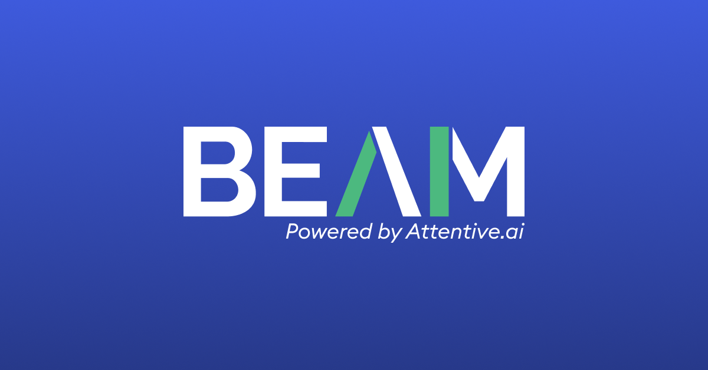

<p align="center">
  
</p>

<h1 align="center">Revy Notetaker</h1>

<p align="center">
  An AI meeting notetaker for <strong>BEAM</strong> (Attentive.ai). Paste a Google Meet
  link — a bot named <strong>Revy Notetaker</strong> joins, records, and live-transcribes
  the call, right in your browser.
</p>

<p align="center">
  🌐 Live: <a href="https://notetakerweb-production.up.railway.app">notetakerweb-production.up.railway.app</a>
  ·
  API: <a href="https://notetakerapi-production.up.railway.app/healthz">notetakerapi-production.up.railway.app</a>
</p>

---

## What works today

- Paste a Google Meet link → a real Recall.ai bot joins the call (branded as **Revy
  Notetaker**, BEAM logo as its camera tile).
- The transcript streams into the web app **live**, speaker-attributed, as the meeting
  happens — verified end-to-end on the hosted deployment, not just locally.
- When the meeting ends, the transcript is saved — every past meeting stays in your
  library, accessible any time.
- Deployed and publicly reachable on Railway (`api` + `web` services), backed by the full
  data model (orgs, users, playbooks, segments, sync jobs — see Milestones below).
- A meeting's status correctly advances all the way to `completed` once the call ends —
  fixed 2026-07-04 (see Security & Reliability below); previously every meeting silently
  got stuck at `meeting_ended` and never finished.

That's it, deliberately — no playbooks UI, segment detection, Chrome extension, or CRM
sync yet. The tables for those exist (M3, done), but the logic that populates and reads
them doesn't (M4 onward). Those are real, planned, and documented (see below), just not
built.

## Security & Reliability

A full whole-codebase bug + security review (2026-07-04) found and fixed 10 issues,
deployed the same night:

- **Meeting URL validation** now checks the real hostname, not a substring — a crafted
  URL could previously point our Recall bot at an attacker-controlled page.
- **Webhook replay protection** — a captured, correctly-signed webhook request used to be
  a forever-valid credential; now rejected outside a 5-minute freshness window.
- **Webhook deduplication** — a redelivered `transcript.data` webhook (Recall uses
  at-least-once delivery) used to insert duplicate transcript text; now a no-op.
- **Atomic bot creation** — a partial failure after a real Recall bot was created used to
  leave it running/billing with no local record and every webhook for it silently
  dropped; DB writes now run in a single transaction, and the bot is stopped on failure.
- **The status-progression bug** described above.
- Plus: the meeting detail page's live-polling loop no longer permanently stops after a
  single transient network error, and a misconfigured deploy (API key set, webhook secret
  not) now fails loudly instead of silently stranding every meeting.

Every API endpoint is still fully open/unauthenticated — a known, intentional V1 scope
decision (see Orchestration.md §12), not something this pass changed. Full detail on
every finding is in `docs/architecture/Orchestration.md` §1.

## Vision & orchestration

This is being built toward a full meeting-intelligence platform: live segment/checklist
detection against user-defined playbooks, a Chrome extension overlay, and saving final
meeting analysis to an internal ops table (same Supabase database — no Airtable) before
syncing it to HubSpot. The **complete architecture — stack decisions, data model, event
flow, security model, git strategy, and build roadmap — lives in
[`docs/architecture/Orchestration.md`](docs/architecture/Orchestration.md).**

That document is the single source of truth for where this project is going and is kept
in sync with reality — read its "Current Status" section (§1) for an honest, ticked-off
account of what's built vs. planned, and don't make non-trivial changes without reading
it first.

### Milestones

| # | Milestone | Status |
|---|---|---|
| M0 | Repo bootstrap | ✅ |
| M1 | Basic persistence (paste link → DB row → bot) | ✅ |
| M2 | Recall.ai contract verified against a live call | ✅ |
| — | Hosted on Railway (`api` + `web`, both publicly reachable) | ✅ |
| — | Live transcript ingestion (webhooks → DB → polling UI), hosted and verified | ✅ |
| M3 | Full data model (orgs, users, playbooks, segments, sync jobs) | ✅ |
| M4 | WebSocket gateway + BullMQ (upgrading past polling) | ⬜ ← next |
| M5 | Segment detection engine (hybrid rules + LLM) | ⬜ |
| M6 | Chrome extension | ⬜ |
| M7 | Admin dashboard for playbooks | ⬜ |
| M9 | HubSpot sync (reads directly from Supabase — no Airtable in the pipeline) | ⬜ |

Full detail on every row above — including *why* each decision was made — is in
`Orchestration.md`.

## How data flows (current, V1 lean architecture)

This is what's actually running today — not the full target architecture (that's in
`Orchestration.md` §3, which includes the Chrome extension, segment detection, and
CRM sync layers that don't exist yet).

```
┌─────────────┐   1. paste a Meet link    ┌───────────────────────┐
│   Browser    │ ────────────────────────▶ │  apps/web (Railway)   │
│              │                            │  Next.js              │
│              │ ◀──────────────────────── │  paste form, library,  │
└─────────────┘   5. poll every ~2s for     │  live transcript view  │
                   meeting + transcript      └───────────┬───────────┘
                                                          │ 2. POST /meetings
                                                          ▼
                                             ┌───────────────────────┐
                                    ┌───────▶│  apps/api (Railway)    │
                                    │        │  NestJS                │
                                    │        │  meetings API +        │
                        4. webhooks │        │  webhook receiver      │
                   (transcript.data,│        └───────────┬───────────┘
                    bot status —    │        3. create bot│  4b. write meeting +
                    HMAC verified)  │        (REST call)  │      transcript rows
                                    │                     ▼            ▼
                          ┌─────────┴──────┐   ┌───────────────────────┐
                          │   Recall.ai     │   │   Supabase Postgres    │
                          │  joins the Meet,│   │  single source of      │
                          │  records, and   │   │  truth — full M3      │
                          │  transcribes    │   │  schema (§6), ~22     │
                          └─────────────────┘   │  tables               │
                                                 └───────────────────────┘
```

Steps, in order: (1) you paste a link, (2) the browser POSTs it to the API, (3) the API
asks Recall to create a bot, which creates a `Meeting` + `MeetingSession` +
`CaptureSession` + `RecallBot` row, (4) as the meeting happens Recall sends webhooks back
to the API — verified with an HMAC signature — resolved to the right session via the
`RecallBot` → `CaptureSession` → `MeetingSession` chain and written straight to Supabase
(no queue yet, that's M4), (5) the browser polls the API every ~2 seconds and renders
whatever's in the database. No WebSockets, no BullMQ, no Redis in this version —
deliberately lean, upgraded later per the roadmap. The full data model (playbooks,
segments, HubSpot sync tables, etc.) exists as of M3 but most of it is unpopulated until
M4 onward builds the logic that reads/writes it — see `Orchestration.md` §6 and §17.

## Costs

Real, current pricing (checked 2026-07) — not a guess:

| Service | Plan | Cost |
|---|---|---|
| **Railway** (`api` + `web`, both always-on) | Hobby | $5/month base (includes $5 usage credit); realistic total for two small always-on Node services is **~$5–20/month** since Railway bills CPU+RAM by the second even when idle, not serverless-style scale-to-zero |
| **Supabase** (Postgres) | Free | **$0/month** at current scale (500 MB DB limit) — ⚠️ the free-tier project auto-pauses after 7 days of no activity; upgrade to Pro ($25/month) before any real/demo usage so it doesn't go cold mid-meeting |
| **Recall.ai** (bot + transcription) | Pay-as-you-go | **$0.50/recording-hour** (bot) + **$0.15/recording-hour** (their built-in transcription, what we use) ≈ **$0.65/hour of actual meeting time**, billed per-second, no monthly platform fee. Free storage for 7 days, then $0.05/media-hour per extra 30 days |
| **HubSpot / Airtable** | — | $0 — not built yet, and Airtable was dropped entirely (§2 of `Orchestration.md`) |

**Realistic current monthly total for light personal use:** roughly **$5–20/month**
(Railway is the floor cost even at zero traffic; Supabase and Recall usage are what
actually scale with real usage). Sources: [Railway pricing](https://railway.com/pricing),
[Supabase pricing](https://supabase.com/pricing), [Recall.ai pricing](https://www.recall.ai/pricing).

## Structure

```
apps/
  api/      — NestJS (Fastify): meetings API + Recall webhook receiver
  web/      — Next.js: paste-link UI, meeting library, live transcript view
  worker/   — background job processor (boots today; BullMQ processors land in M4)
packages/
  contracts/ — shared Zod schemas & types (single source of truth for API shapes)
  config/    — environment loading/validation
  db/        — Prisma schema + client (Postgres, hosted on Supabase) — full M3 schema,
               ~22 entities: orgs/users/playbooks/segments/sync jobs, see schema.prisma
  recall/    — typed Recall.ai client, webhook signature verification + replay protection,
               bot branding asset, and the minimal CaptureProvider interface (Recall today,
               swappable for a local/desktop capture provider later)
docs/
  architecture/Orchestration.md — the plan (read this first)
  runbooks/local-dev.md         — local environment setup
  runbooks/webhook-debugging.md — diagnosing/recovering from webhook delivery failures
  superpowers/plans/            — implementation plans for larger pieces of work (e.g.
                                   the M3 data model migration), kept after execution as
                                   a record of what was built and why
scripts/
  recall-spike.ts — live-call verification tool against the real Recall.ai API
```

## Quickstart

```bash
pnpm install
cp apps/api/.env.example apps/api/.env   # fill in Supabase + Recall values
pnpm --filter @notetaker/db migrate:deploy
pnpm dev                                  # api :4000, web :3000, worker
```

Postgres is hosted on Supabase for every environment, including local dev — there is no
local database to install. Get connection strings from your Supabase project's
**Connect → ORMs → Prisma** panel. See
[`docs/runbooks/local-dev.md`](docs/runbooks/local-dev.md) for full setup details.

Then open http://localhost:3000, paste a Google Meet link you're about to join, and admit
the bot when it knocks. Locally, live transcript updates won't arrive (Recall can't reach
`localhost`) — that only works once deployed with a public webhook URL.

## Recall spike

A standalone tool for verifying the Recall.ai API against a real, live call — useful any
time the contract needs re-checking (region, payload shape, new event types):

```bash
RECALL_API_KEY=... MEETING_URL=https://meet.google.com/xxx-xxxx-xxx pnpm recall:spike
```

It creates a real bot, polls status transitions live, and dumps the full raw payload to
`scripts/fixtures/` once the call ends.

## Deployment

Hosted on **Railway** — two services (`api`, `web`) in one project, both rooted at the
repo root (required for the pnpm workspace to resolve):

| Service | Build | Start | Live URL |
|---|---|---|---|
| `api` | `pnpm install && pnpm build` | `pnpm --filter @notetaker/api start` | notetakerapi-production.up.railway.app |
| `web` | `pnpm install && pnpm build` | `pnpm --filter @notetaker/web start` | notetakerweb-production.up.railway.app |

**`api` env vars:** `RECALL_API_KEY`, `RECALL_REGION`, `RECALL_WEBHOOK_SECRET` (from
`https://{region}.recall.ai/dashboard/webhooks/`, format `whsec_...` — configured), `DATABASE_URL`,
`DIRECT_URL`, `APP_BASE_URL` (the `api` service's own public URL above — this is what gets
baked into each new bot's per-bot transcript webhook URL at creation time; if it's ever
missing again, new bots silently point their transcript webhook at `localhost:4000`, see
`docs/runbooks/webhook-debugging.md`).

**`web` env vars:** `NEXT_PUBLIC_API_URL` (the `api` service's public URL above).

Both `RECALL_WEBHOOK_SECRET` and `APP_BASE_URL` were the two real blockers that kept the
hosted webhook pipeline non-functional for a while — see the "Historical incident" note in
`docs/runbooks/webhook-debugging.md` for the full story if you ever see the same symptoms
again (status stuck at `bot_joining`, or status advancing fine but no transcript ever
appearing). As of 2026-07-04, the API also fails fast at bot-creation time if
`RECALL_API_KEY` is set but `RECALL_WEBHOOK_SECRET` isn't, instead of silently stranding
the meeting.

### Deployment gotchas learned the hard way

- **`NEXT_PUBLIC_*` env vars bake in at Next.js build time**, not runtime. Changing one
  in Railway's dashboard does nothing until you trigger a fresh build (not just a
  restart) — the old value is already compiled into the JS bundle.
- **`.railway.internal` addresses are private-network-only** — never put one in
  `NEXT_PUBLIC_API_URL`; the browser can't resolve it. Always use the service's public
  domain (Settings → Networking → Public Networking → Generate Domain).
- **Missing env vars fail silently from the client's perspective** — a missing
  `DATABASE_URL` on the API produces a 500 with no useful client-side message ("Failed to
  fetch"); always check the service's own deploy logs, not just the browser.

## Contributing

Trunk-based development, short-lived feature branches
(`feature/<area>-<description>`, `fix/...`, `docs/...`), Conventional Commits. Full
branching and commit conventions are in `Orchestration.md` §15–16.
